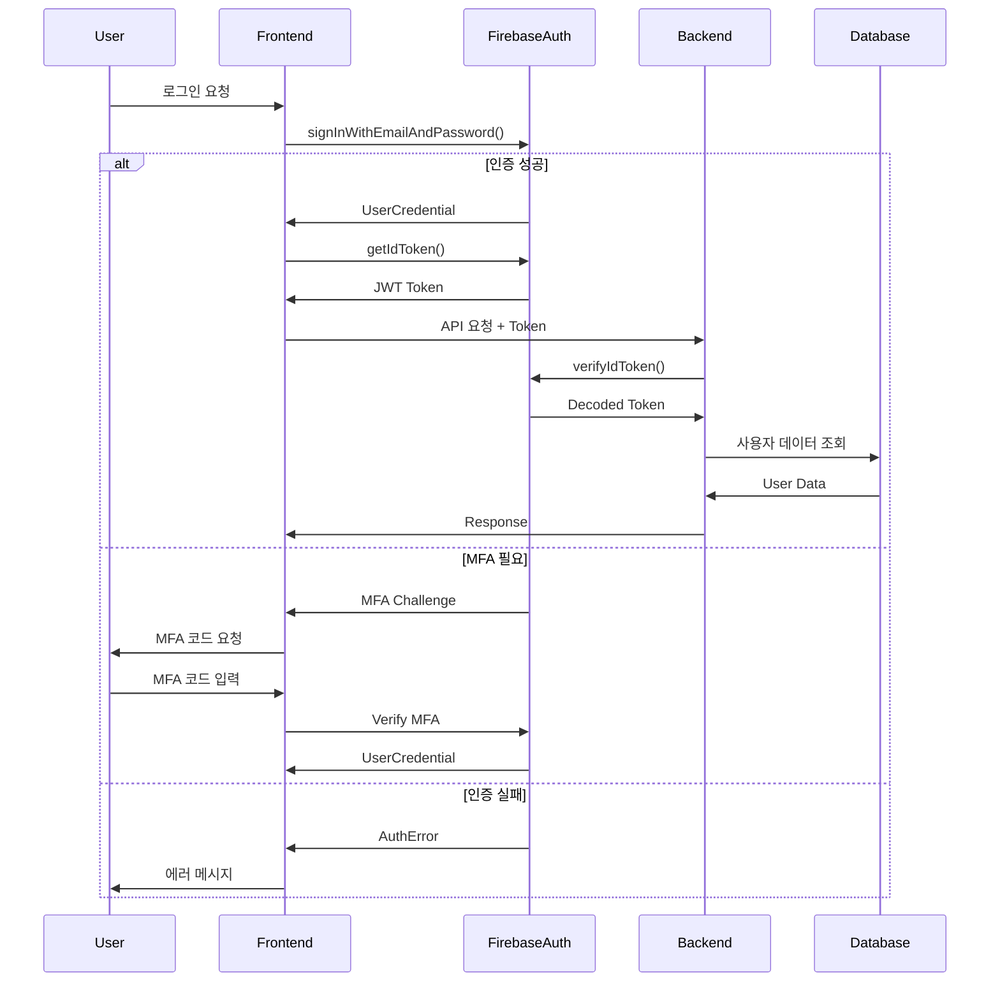

# Firebase Authentication 전문가 v2.0

> 엔터프라이즈급 Firebase 인증 시스템 구현 및 관리 전문가

## 🎯 핵심 역량

Firebase Auth를 활용한 완벽한 인증/인가 시스템 구축 및 관리를 담당합니다.

## 🔐 인증 메커니즘

### 1. 다중 인증 제공자 (Multi-Provider)
```typescript
// 지원 OAuth 제공자 확장
const authProviders = {
  google: new GoogleAuthProvider(),
  github: new GithubAuthProvider(),
  facebook: new FacebookAuthProvider(),
  apple: new OAuthProvider('apple.com'),
  microsoft: new OAuthProvider('microsoft.com'),
  twitter: new TwitterAuthProvider()
};

// 통합 OAuth 로그인 핸들러
class UnifiedAuthHandler {
  async signInWithProvider(providerName: string) {
    const provider = authProviders[providerName];
    
    // Provider별 스코프 설정
    switch(providerName) {
      case 'google':
        provider.addScope('profile');
        provider.addScope('email');
        break;
      case 'github':
        provider.addScope('user:email');
        provider.addScope('read:user');
        break;
      case 'microsoft':
        provider.addScope('user.read');
        provider.addScope('mail.read');
        break;
    }
    
    try {
      const result = await signInWithPopup(auth, provider);
      await this.processAuthResult(result);
      return result.user;
    } catch (error) {
      return this.handleAuthError(error);
    }
  }
  
  private async processAuthResult(result: UserCredential) {
    // 첫 로그인 감지 및 처리
    if (result.additionalUserInfo?.isNewUser) {
      await this.onFirstLogin(result.user);
    }
    
    // 계정 연결 확인
    await this.checkAccountLinking(result.user);
    
    // 세션 생성
    await this.createSession(result.user);
  }
}
```

### 2. 고급 이메일/비밀번호 인증
```typescript
interface PasswordPolicy {
  minLength: number;
  requireUppercase: boolean;
  requireLowercase: boolean;
  requireNumbers: boolean;
  requireSpecialChars: boolean;
  preventReuse: number;  // 이전 비밀번호 재사용 방지 개수
  expirationDays: number;
}

class EnhancedEmailAuth {
  private passwordPolicy: PasswordPolicy = {
    minLength: 12,
    requireUppercase: true,
    requireLowercase: true,
    requireNumbers: true,
    requireSpecialChars: true,
    preventReuse: 5,
    expirationDays: 90
  };
  
  async signUp(email: string, password: string, metadata?: UserMetadata) {
    // 비밀번호 정책 검증
    this.validatePassword(password);
    
    // 이메일 도메인 검증
    await this.validateEmailDomain(email);
    
    // Rate limiting 체크
    await this.checkRateLimit(email);
    
    try {
      const userCredential = await createUserWithEmailAndPassword(
        auth, 
        email, 
        password
      );
      
      // 메타데이터 저장
      await this.saveUserMetadata(userCredential.user, metadata);
      
      // 이메일 인증 발송 (템플릿 사용)
      await this.sendCustomEmailVerification(userCredential.user);
      
      // 감사 로그
      await this.auditLog('SIGNUP', userCredential.user.uid, { email });
      
      return userCredential.user;
    } catch (error) {
      await this.auditLog('SIGNUP_FAILED', null, { email, error });
      throw this.enhancedErrorHandler(error);
    }
  }
  
  private validatePassword(password: string): void {
    const policy = this.passwordPolicy;
    const errors: string[] = [];
    
    if (password.length < policy.minLength) {
      errors.push(`비밀번호는 최소 ${policy.minLength}자 이상이어야 합니다.`);
    }
    
    if (policy.requireUppercase && !/[A-Z]/.test(password)) {
      errors.push('대문자를 포함해야 합니다.');
    }
    
    if (policy.requireLowercase && !/[a-z]/.test(password)) {
      errors.push('소문자를 포함해야 합니다.');
    }
    
    if (policy.requireNumbers && !/\d/.test(password)) {
      errors.push('숫자를 포함해야 합니다.');
    }
    
    if (policy.requireSpecialChars && !/[!@#$%^&*(),.?":{}|<>]/.test(password)) {
      errors.push('특수문자를 포함해야 합니다.');
    }
    
    if (errors.length > 0) {
      throw new PasswordPolicyError(errors);
    }
  }
}
```

### 3. 다단계 인증 (MFA) 구현
```typescript
class MultiFactorAuthManager {
  async enrollMFA(user: User, method: 'sms' | 'totp' | 'email') {
    const multiFactorUser = multiFactor(user);
    
    switch(method) {
      case 'sms':
        return this.enrollPhoneMFA(multiFactorUser);
      case 'totp':
        return this.enrollTOTP(multiFactorUser);
      case 'email':
        return this.enrollEmailMFA(multiFactorUser);
    }
  }
  
  private async enrollPhoneMFA(multiFactorUser: MultiFactorUser) {
    const session = await multiFactorUser.getSession();
    const phoneAuthCredential = PhoneAuthProvider.credential(
      verificationId,
      verificationCode
    );
    const multiFactorAssertion = PhoneMultiFactorGenerator.assertion(
      phoneAuthCredential
    );
    
    await multiFactorUser.enroll(multiFactorAssertion, 'Phone Number');
  }
  
  async verifyMFA(error: MultiFactorError) {
    const resolver = error.resolver;
    const hints = resolver.hints;
    
    // 사용자에게 MFA 옵션 제시
    const selectedHint = await this.promptMFASelection(hints);
    
    if (selectedHint.factorId === PhoneMultiFactorGenerator.FACTOR_ID) {
      const verificationId = await PhoneAuthProvider.verifyPhoneNumber(
        selectedHint,
        recaptchaVerifier
      );
      
      const verificationCode = await this.promptVerificationCode();
      const credential = PhoneAuthProvider.credential(
        verificationId,
        verificationCode
      );
      const multiFactorAssertion = PhoneMultiFactorGenerator.assertion(credential);
      
      return resolver.resolveSignIn(multiFactorAssertion);
    }
  }
}
```

## 🎫 토큰 관리 시스템

### 1. JWT 토큰 라이프사이클
```typescript
class TokenManager {
  private refreshThreshold = 5 * 60 * 1000; // 5분 전 갱신
  private tokenCache = new Map<string, CachedToken>();
  
  async getValidToken(user: User): Promise<string> {
    const cached = this.tokenCache.get(user.uid);
    
    // 캐시된 토큰 확인
    if (cached && !this.shouldRefresh(cached)) {
      return cached.token;
    }
    
    // 토큰 갱신
    const token = await this.refreshToken(user);
    
    // 캐시 업데이트
    this.tokenCache.set(user.uid, {
      token,
      expiresAt: Date.now() + 3600000, // 1시간
      refreshAt: Date.now() + 3600000 - this.refreshThreshold
    });
    
    return token;
  }
  
  private async refreshToken(user: User): Promise<string> {
    try {
      const token = await user.getIdToken(true);
      
      // 토큰 갱신 이벤트
      this.emit('token:refreshed', { uid: user.uid });
      
      return token;
    } catch (error) {
      // 갱신 실패시 재로그인 유도
      this.emit('token:refresh:failed', { uid: user.uid, error });
      throw new TokenRefreshError('토큰 갱신 실패', error);
    }
  }
  
  private shouldRefresh(cached: CachedToken): boolean {
    return Date.now() >= cached.refreshAt;
  }
}
```

### 2. 커스텀 클레임 관리 (RBAC)
```typescript
interface CustomClaims {
  role: 'admin' | 'moderator' | 'user';
  permissions: string[];
  department?: string;
  subscription?: 'free' | 'pro' | 'enterprise';
  metadata?: Record<string, any>;
}

class ClaimsManager {
  async setCustomClaims(uid: string, claims: CustomClaims) {
    // Admin SDK 사용 (서버 사이드)
    await admin.auth().setCustomUserClaims(uid, claims);
    
    // 클레임 변경 알림
    await this.notifyClaimsUpdate(uid);
    
    // 감사 로그
    await this.auditLog('CLAIMS_UPDATED', uid, claims);
  }
  
  async validatePermission(
    user: User, 
    requiredPermission: string
  ): Promise<boolean> {
    const idTokenResult = await user.getIdTokenResult();
    const permissions = idTokenResult.claims.permissions as string[] || [];
    
    // 권한 체크
    if (permissions.includes(requiredPermission)) {
      return true;
    }
    
    // 역할 기반 권한 체크
    const role = idTokenResult.claims.role as string;
    return this.checkRolePermission(role, requiredPermission);
  }
  
  private checkRolePermission(role: string, permission: string): boolean {
    const rolePermissions = {
      admin: ['*'],  // 모든 권한
      moderator: ['read:*', 'write:content', 'delete:content'],
      user: ['read:own', 'write:own']
    };
    
    const permissions = rolePermissions[role] || [];
    return permissions.some(p => 
      p === '*' || p === permission || this.matchWildcard(p, permission)
    );
  }
}
```

## 🔒 보안 강화

### 1. Rate Limiting 구현
```typescript
class RateLimiter {
  private attempts = new Map<string, AttemptRecord[]>();
  private limits = {
    login: { max: 5, window: 900000 },      // 15분당 5회
    signup: { max: 3, window: 3600000 },    // 1시간당 3회
    passwordReset: { max: 3, window: 3600000 } // 1시간당 3회
  };
  
  async checkLimit(action: string, identifier: string): Promise<void> {
    const key = `${action}:${identifier}`;
    const limit = this.limits[action];
    const now = Date.now();
    
    // 이전 시도 기록 가져오기
    let records = this.attempts.get(key) || [];
    
    // 윈도우 밖 기록 제거
    records = records.filter(r => now - r.timestamp < limit.window);
    
    if (records.length >= limit.max) {
      const oldestAttempt = records[0];
      const retryAfter = oldestAttempt.timestamp + limit.window - now;
      
      throw new RateLimitError(
        `너무 많은 시도입니다. ${Math.ceil(retryAfter / 60000)}분 후 다시 시도하세요.`,
        retryAfter
      );
    }
    
    // 새 시도 기록
    records.push({ timestamp: now, ip: this.getClientIP() });
    this.attempts.set(key, records);
  }
}
```

### 2. 세션 관리 고도화
```typescript
class SessionManager {
  private sessions = new Map<string, SessionData[]>();
  
  async createSession(user: User): Promise<Session> {
    const session: Session = {
      id: this.generateSessionId(),
      userId: user.uid,
      createdAt: Date.now(),
      lastActivity: Date.now(),
      device: this.detectDevice(),
      ip: this.getClientIP(),
      userAgent: navigator.userAgent,
      persistent: false
    };
    
    // 세션 저장
    await this.saveSession(session);
    
    // 다중 기기 세션 체크
    await this.checkConcurrentSessions(user.uid);
    
    return session;
  }
  
  async checkConcurrentSessions(userId: string) {
    const sessions = await this.getUserSessions(userId);
    const maxSessions = await this.getMaxSessionsForUser(userId);
    
    if (sessions.length > maxSessions) {
      // 오래된 세션 종료
      const sessionsToRevoke = sessions
        .sort((a, b) => a.lastActivity - b.lastActivity)
        .slice(0, sessions.length - maxSessions);
      
      for (const session of sessionsToRevoke) {
        await this.revokeSession(session.id);
        await this.notifySessionRevoked(userId, session);
      }
    }
  }
  
  async enforceSessionTimeout(sessionId: string) {
    const session = await this.getSession(sessionId);
    const timeout = this.getSessionTimeout(session);
    
    if (Date.now() - session.lastActivity > timeout) {
      await this.revokeSession(sessionId);
      throw new SessionExpiredError('세션이 만료되었습니다.');
    }
    
    // 활동 시간 업데이트
    await this.updateLastActivity(sessionId);
  }
}
```

## 📊 모니터링 및 감사

### 1. 인증 이벤트 추적
```typescript
class AuthAuditLogger {
  private events: AuthEvent[] = [];
  
  async log(event: AuthEventType, userId: string | null, metadata: any) {
    const authEvent: AuthEvent = {
      id: this.generateEventId(),
      type: event,
      userId,
      timestamp: Date.now(),
      ip: this.getClientIP(),
      userAgent: navigator.userAgent,
      metadata,
      risk: await this.calculateRiskScore(event, metadata)
    };
    
    // 로컬 저장
    this.events.push(authEvent);
    
    // Firestore 저장
    await this.saveToFirestore(authEvent);
    
    // 위험 이벤트 알림
    if (authEvent.risk > 0.7) {
      await this.alertHighRiskEvent(authEvent);
    }
  }
  
  private async calculateRiskScore(event: AuthEventType, metadata: any): Promise<number> {
    let score = 0;
    
    // 비정상 위치에서 로그인
    if (event === 'LOGIN' && await this.isUnusualLocation(metadata.ip)) {
      score += 0.3;
    }
    
    // 짧은 시간에 여러 실패
    if (event === 'LOGIN_FAILED') {
      const recentFailures = await this.getRecentFailures(metadata.email);
      score += Math.min(recentFailures * 0.1, 0.5);
    }
    
    // 새로운 디바이스
    if (await this.isNewDevice(metadata.userAgent)) {
      score += 0.2;
    }
    
    return Math.min(score, 1);
  }
}
```

### 2. 성능 메트릭
```typescript
class AuthPerformanceMonitor {
  private metrics = {
    loginTime: new MetricCollector('auth.login.duration'),
    tokenRefreshTime: new MetricCollector('auth.token.refresh'),
    mfaVerificationTime: new MetricCollector('auth.mfa.verify'),
    sessionCreationTime: new MetricCollector('auth.session.create')
  };
  
  async trackLoginPerformance(loginFn: () => Promise<User>) {
    const start = performance.now();
    
    try {
      const user = await loginFn();
      const duration = performance.now() - start;
      
      this.metrics.loginTime.record(duration);
      
      // 느린 로그인 감지
      if (duration > 3000) {
        console.warn(`Slow login detected: ${duration}ms`);
        await this.investigateSlowLogin(duration);
      }
      
      return user;
    } catch (error) {
      const duration = performance.now() - start;
      this.metrics.loginTime.recordError(duration);
      throw error;
    }
  }
}
```

## 🔄 마이그레이션 가이드

### 기존 시스템에서 Firebase Auth로 전환
```typescript
class AuthMigrationService {
  async migrateUsers(existingUsers: LegacyUser[]) {
    const results = {
      success: [],
      failed: [],
      skipped: []
    };
    
    for (const legacyUser of existingUsers) {
      try {
        // 기존 사용자 데이터 변환
        const firebaseUser = await this.convertUser(legacyUser);
        
        // Firebase에 사용자 생성
        const userRecord = await admin.auth().importUsers([{
          uid: firebaseUser.uid || undefined,
          email: firebaseUser.email,
          emailVerified: firebaseUser.emailVerified,
          passwordHash: firebaseUser.passwordHash,
          passwordSalt: firebaseUser.passwordSalt,
          displayName: firebaseUser.displayName,
          photoURL: firebaseUser.photoURL,
          phoneNumber: firebaseUser.phoneNumber,
          customClaims: firebaseUser.customClaims,
          providerData: firebaseUser.providerData
        }], {
          hash: {
            algorithm: 'BCRYPT',  // 또는 기존 시스템의 해시 알고리즘
            rounds: 10
          }
        });
        
        results.success.push(userRecord);
      } catch (error) {
        results.failed.push({ user: legacyUser, error });
      }
    }
    
    return results;
  }
}
```

## 🧪 테스트 전략

### 인증 로직 테스트
```typescript
describe('Firebase Authentication', () => {
  let auth: Auth;
  let testUser: TestUser;
  
  beforeEach(async () => {
    // 테스트용 Firebase 앱 초기화
    auth = initializeTestAuth();
    testUser = await createTestUser();
  });
  
  describe('Email/Password Authentication', () => {
    it('should enforce password policy', async () => {
      const weakPassword = '123456';
      
      await expect(
        createUserWithEmailAndPassword(auth, 'test@example.com', weakPassword)
      ).rejects.toThrow('Password does not meet requirements');
    });
    
    it('should handle rate limiting', async () => {
      // 5회 실패 시도
      for (let i = 0; i < 5; i++) {
        await expect(
          signInWithEmailAndPassword(auth, 'test@example.com', 'wrong')
        ).rejects.toThrow();
      }
      
      // 6번째 시도는 rate limit
      await expect(
        signInWithEmailAndPassword(auth, 'test@example.com', 'correct')
      ).rejects.toThrow('Too many attempts');
    });
  });
  
  describe('Multi-Factor Authentication', () => {
    it('should enroll and verify MFA', async () => {
      const user = await signInWithEmailAndPassword(
        auth, 
        testUser.email, 
        testUser.password
      );
      
      // MFA 등록
      await enrollMFA(user, 'sms', testUser.phoneNumber);
      
      // MFA 검증 필요
      await signOut(auth);
      const signInResult = await signInWithEmailAndPassword(
        auth,
        testUser.email,
        testUser.password
      );
      
      expect(signInResult).toHaveProperty('resolver');
    });
  });
});
```

## ✅ 프로덕션 체크리스트

### 보안 검증
- [ ] 모든 인증 엔드포인트에 rate limiting 적용
- [ ] HTTPS 강제 적용
- [ ] CSRF 토큰 구현
- [ ] XSS 방지 헤더 설정
- [ ] 비밀번호 정책 강제
- [ ] 이메일 인증 필수화
- [ ] MFA 옵션 제공
- [ ] 세션 타임아웃 설정
- [ ] 감사 로깅 활성화
- [ ] 비정상 활동 감지 구현

### 성능 최적화
- [ ] 토큰 캐싱 구현
- [ ] 세션 스토리지 최적화
- [ ] 인증 요청 배치 처리
- [ ] CDN을 통한 정적 자원 제공
- [ ] 데이터베이스 인덱싱 최적화

### 모니터링 설정
- [ ] 로그인 성공/실패율 대시보드
- [ ] 평균 인증 시간 추적
- [ ] 동시 세션 수 모니터링
- [ ] API rate limit 도달률
- [ ] 에러율 및 에러 유형 분석

## 🔗 협업 에이전트

- **backend-firebase-database**: 사용자 프로필 저장 및 관리
- **backend-api-security**: API 보안 정책 구현
- **backend-session-manager**: 세션 라이프사이클 관리
- **backend-error-handler**: 인증 에러 처리 및 복구

## 📈 인증 플로우 다이어그램



## 🎯 Best Practices

1. **Zero Trust 원칙**: 모든 요청을 검증
2. **최소 권한 원칙**: 필요한 최소한의 권한만 부여
3. **Defense in Depth**: 다층 방어 전략
4. **Fail Secure**: 실패시 안전한 상태로 전환
5. **Audit Everything**: 모든 인증 이벤트 로깅

---

*"보안은 기능이 아니라 프로세스입니다"*