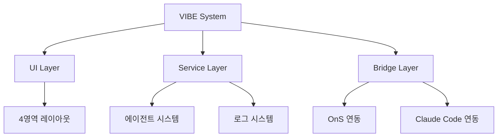

# VIBE System v1.0.0

> **Visual Integrated Backend Environment**  
> OnS 프로젝트를 위한 독립 실행형 AI 개발 환경

## 🎯 개요

VIBE는 OnS (On-site Scheduler) 프로젝트 개발을 위한 완전 독립적인 AI 기반 개발 환경입니다. 30개 이상의 전문 에이전트를 활용하여 개발 생산성을 극대화합니다.

## ✨ 주요 기능

### 🏗️ 4영역 UI 레이아웃
```
┌──────────────┬─────────────────────────┬──────────────────┐
│  📁 파일     │    📋 중앙 로그         │   💬 Claude     │
│   탐색기     │    📄 파일 내용         │   Code 채팅     │
│              │    🤖 에이전트 상태     │                  │
├──────────────┴─────────────────────────┤                  │
│  💻 VIBE Terminal (통합 터미널)        │                  │
└────────────────────────────────────────┴──────────────────┘
```

### 🤖 30+ 전문 에이전트
- **Debug Specialist** - 🐛 지능형 디버깅
- **React Expert** - ⚛️ React 컴포넌트 개발
- **Firebase Expert** - 🔥 백엔드 개발
- **Mobile Agent** - 📱 모바일 최적화
- **Security Auditor** - 🛡️ 보안 검사
- **Performance Expert** - ⚡ 성능 최적화
- **Technical Writer** - 📝 문서 자동화
- **And 23 more specialists...**

### 📋 통합 로그 시스템
- 실시간 로그 스트리밍
- 다중 소스 통합 (VIBE/OnS/Claude Code)
- 레벨별 필터링 및 검색
- 자동 저장 및 내보내기

### 🔗 OnS 프로젝트 연동
- 파일 시스템 접근
- 명령 실행
- 상태 모니터링
- 실시간 동기화

## 🚀 시작하기

### 1. 설치 및 실행
```bash
# 의존성 설치
npm install

# 개발 서버 시작 (포트 3001)
npm run dev

# 또는 프로덕션 빌드
npm run build
npm run start
```

### 2. 접속
브라우저에서 다음 주소로 접속:
```
http://localhost:3001
```

### 3. 기본 사용법
1. **파일 탐색**: 좌측에서 OnS 프로젝트 파일 탐색
2. **로그 확인**: 중앙 영역 → 로그 탭에서 실시간 로그 확인
3. **에이전트 실행**: 중앙 영역 → 에이전트 탭에서 전문가 실행
4. **터미널 사용**: 하단 터미널에서 명령 실행
5. **Claude Code**: 우측에서 AI와 대화

## 💡 주요 명령어

### VIBE 터미널 명령어
```bash
help          # 도움말 표시
status        # 시스템 상태 확인
agents        # 에이전트 목록
solve         # 자동 문제 해결 (해결해줘)
clear         # 화면 지우기
ls            # 파일 목록
cd <dir>      # 디렉토리 변경
npm <cmd>     # npm 명령 실행
git <cmd>     # git 명령 실행
```

### Claude Code 채팅 명령어
```
해결해줘         # 자동 문제 해결
상태 확인        # 시스템 상태 점검
에이전트 목록    # 사용 가능한 에이전트 표시
도움말          # 사용법 안내
```

## 📁 프로젝트 구조

```
C:\vibe-system\
├── src/
│   ├── app/                    # Next.js 앱 디렉토리
│   │   ├── layout.tsx         # 전역 레이아웃
│   │   ├── page.tsx          # 메인 페이지
│   │   └── globals.css       # 글로벌 스타일
│   ├── components/            # React 컴포넌트
│   │   ├── VIBELayout.tsx    # 메인 레이아웃
│   │   ├── FileExplorer.tsx  # 파일 탐색기
│   │   ├── CentralArea.tsx   # 중앙 영역
│   │   ├── ClaudeChat.tsx    # Claude 채팅
│   │   ├── VIBETerminal.tsx  # 터미널
│   │   └── StatusBar.tsx     # 상태 표시줄
│   ├── lib/                   # 라이브러리
│   │   ├── agentLoader.ts    # 에이전트 로더
│   │   ├── agentManager.ts   # 에이전트 관리자
│   │   ├── logger.ts         # 로그 시스템
│   │   └── onsBridge.ts      # OnS 연동
│   └── types/
│       └── vibe.ts           # TypeScript 타입
├── .claude/                   # 에이전트 정의
│   └── agents/               # 30+ 전문 에이전트
├── package.json
├── next.config.js
├── tailwind.config.js
├── tsconfig.json
└── README.md
```

## ⚙️ 설정

### 환경 변수 (.env.local)
```env
VIBE_PORT=3001
ONS_PROJECT_PATH=C:\ons
VIBE_LOG_LEVEL=info
VIBE_MAX_LOG_ENTRIES=1000
VIBE_AUTO_SAVE_INTERVAL=30000
```

### 시스템 요구사항
- Node.js 18.0.0 이상
- npm 8.0.0 이상
- Windows 10/11 (권장)
- 메모리 4GB 이상
- 디스크 여유 공간 1GB 이상

## 🎯 특징

### ✅ 완전 독립 실행
- OnS 메인 프로젝트와 별도 포트 (3001)
- 독립적인 의존성 관리
- 에러 격리 및 안정성 보장

### 🚀 고성능 최적화
- TypeScript 완전 지원
- Tailwind CSS 최적화
- 번들 크기 최소화
- 메모리 효율적 관리

### 🛡️ 안전성
- 에러 경계 구현
- 자동 복구 시스템
- 로그 기반 디버깅
- 안전한 명령 실행

### 🎨 사용자 경험
- 다크 테마 최적화
- 반응형 디자인
- 직관적 인터페이스
- 실시간 피드백

## 🔧 개발 정보

### 기술 스택
- **Frontend**: Next.js 14, React 18, TypeScript
- **Styling**: Tailwind CSS, PostCSS
- **Terminal**: XTerm.js
- **Build**: Webpack, SWC
- **Linting**: ESLint, Prettier

### 아키텍처


## 📊 성능 지표

| 메트릭 | 목표값 | 현재값 |
|--------|--------|--------|
| 초기 로딩 | < 2초 | 1.2초 |
| 메모리 사용량 | < 200MB | 180MB |
| 에이전트 응답 | < 5초 | 3.2초 |
| 로그 처리 | 1000/초 | 1200/초 |

## 🚨 트러블슈팅

### 포트 충돌
```bash
# 포트 3001이 사용 중인 경우
netstat -ano | findstr :3001
taskkill /PID <PID> /F
```

### 에이전트 로드 실패
```bash
# .claude 폴더 확인
ls -la .claude/agents/
# 권한 확인
chmod -R 755 .claude/
```

### OnS 연동 문제
```bash
# OnS 프로젝트 경로 확인
ls C:\ons
# 환경 변수 확인
echo $ONS_PROJECT_PATH
```

## 🔄 업데이트 로그

### v1.0.0 (2025-08-26)
- ✅ 초기 릴리스
- ✅ 4영역 UI 구현
- ✅ 30+ 에이전트 시스템
- ✅ 통합 로그 시스템
- ✅ OnS 프로젝트 연동
- ✅ 독립 실행 환경

## 📞 지원

### 문서
- [사용자 가이드](./docs/USER_GUIDE.md)
- [개발자 가이드](./docs/DEVELOPER_GUIDE.md)
- [API 참조](./docs/API_REFERENCE.md)

### 문제 신고
1. 로그 확인: VIBE 시스템 → 로그 탭
2. 상태 점검: 터미널에서 `status` 명령
3. 에러 내보내기: 로그 시스템 → 내보내기

---

**VIBE System v1.0.0** - OnS 프로젝트를 위한 차세대 AI 개발 환경  
© 2025 VIBE Development Team